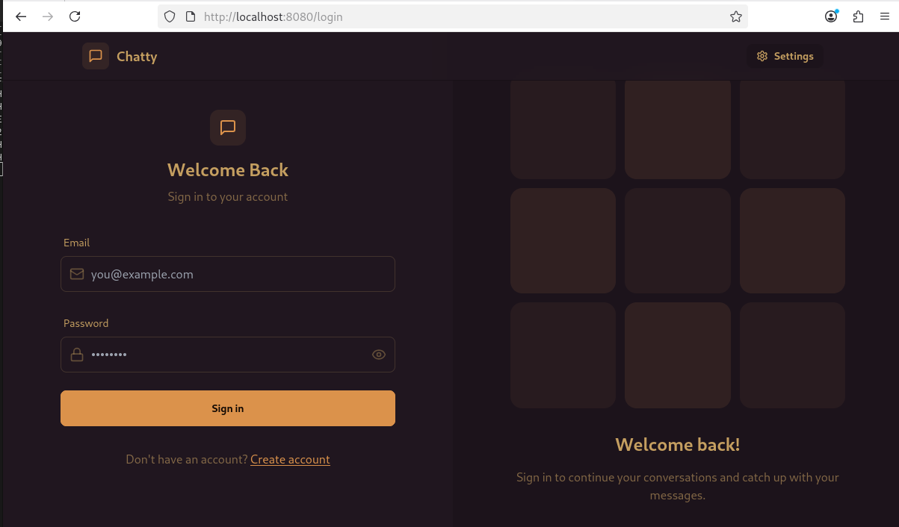
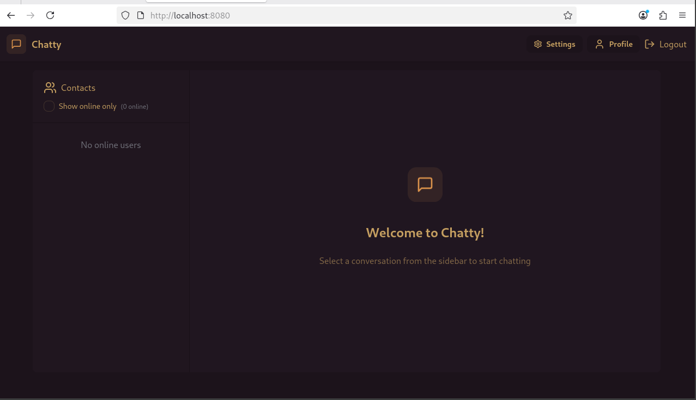
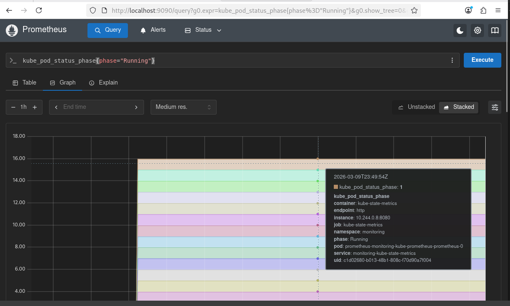
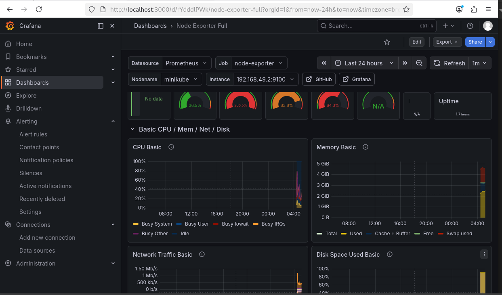

# 🚀 3-Tier Chat Application — Kubernetes Deployment & Monitoring

A production-style deployment of a full-stack real-time chat application on Kubernetes with Prometheus & Grafana monitoring.










---

## 📌 Project Overview

This project demonstrates deploying a **3-tier chat application** on a local Kubernetes cluster using Minikube. It includes containerization with Docker, orchestration with Kubernetes, and full observability using Prometheus and Grafana deployed via Helm charts.

---

## 🏗️ Architecture

```
                        ┌─────────────────┐
                        │    Frontend     │
                        │  React + Nginx  │
                        │   Port: 8080    │
                        └────────┬────────┘
                                 │
                        ┌────────▼────────┐
                        │    Backend      │
                        │ Node.js+Socket  │
                        │   Port: 5001    │
                        └────────┬────────┘
                                 │
                        ┌────────▼────────┐
                        │    MongoDB      │
                        │   Database      │
                        │   Port: 27017   │
                        └─────────────────┘
```

---

## 🛠️ Tech Stack

| Layer | Technology |
|-------|-----------|
| Frontend | React, TailwindCSS, Nginx |
| Backend | Node.js, Express, Socket.io |
| Database | MongoDB |
| Auth | JWT (JSON Web Tokens) |
| Containerization | Docker |
| Orchestration | Kubernetes (Minikube) |
| Monitoring | Prometheus, Grafana |
| Package Manager | Helm |

---

## 📁 Project Structure

```
full-stack_chatApp/
├── backend/                  # Node.js backend
│   └── Dockerfile
├── frontend/                 # React frontend
│   └── Dockerfile
├── k8s/                      # Kubernetes manifests
│   ├── namespace.yml
│   ├── secrets.yml
│   ├── backend-deployment.yml
│   ├── backend-service.yml
│   ├── frontend-deployment.yml
│   ├── frontend-service.yml
│   ├── mongodb-deployment.yml
│   ├── mongodb-service.yml
│   ├── mongodb-pv.yml
│   ├── mongodb-pvc.yml
│   └── ingress.yml
└── docker-compose.yml
```

---

## ✅ Prerequisites

Make sure these tools are installed:

```bash
docker --version        # Docker
minikube version        # Minikube
kubectl version         # Kubectl
helm version            # Helm
```

---

## 🚀 Step-by-Step Setup

### Step 1 — Clone the Repository

```bash
git clone https://github.com/LondheShubham153/full-stack_chatApp.git
cd full-stack_chatApp
```

---

### Step 2 — Start Minikube

```bash
minikube start --cpus=2 --memory=4096
```

---

### Step 3 — Build Backend Image inside Minikube

```bash
# Point Docker to Minikube's Docker daemon
eval $(minikube docker-env)

# Build backend image locally
docker build -t backend:local ./backend
```

> ⚠️ This step is required every time Minikube restarts.

---

### Step 4 — Deploy to Kubernetes

```bash
# Apply all manifests
kubectl apply -f k8s/

# Watch pods come up
kubectl get pods -n chat-app -w
```

Expected output:
```
NAME                                   READY   STATUS    RESTARTS   AGE
backend-deployment-xxx                 1/1     Running   0          1m
frontend-deployment-xxx                1/1     Running   0          1m
mongodb-deployment-xxx                 1/1     Running   0          1m
```

---

### Step 5 — Access the Application

```bash
kubectl port-forward svc/frontend 8080:80 -n chat-app
```

Open browser: **http://localhost:8080**

---

### Step 6 — Install Prometheus & Grafana via Helm

```bash
# Add Helm repo
helm repo add prometheus-community https://prometheus-community.github.io/helm-charts
helm repo update

# Install monitoring stack
helm install monitoring prometheus-community/kube-prometheus-stack \
  --namespace monitoring \
  --create-namespace

# Watch monitoring pods
kubectl get pods -n monitoring -w
```

---

### Step 7 — Access Grafana

```bash
# Get Grafana password
kubectl get secret monitoring-grafana -n monitoring \
  -o jsonpath="{.data.admin-password}" | base64 --decode

# Port forward
kubectl port-forward svc/monitoring-grafana 3000:80 -n monitoring &
```

Open browser: **http://localhost:3000**
- Username: `admin`
- Password: *(from command above)*

---

### Step 8 — Access Prometheus

```bash
kubectl port-forward svc/monitoring-kube-prometheus-prometheus 9090:9090 -n monitoring &
```

Open browser: **http://localhost:9090**

---

### Step 9 — Import Grafana Dashboard

```bash
# Download Node Exporter dashboard
curl -o /tmp/dashboard.json \
  https://grafana.com/api/dashboards/1860/revisions/latest/download
```

In Grafana:
1. Go to **Dashboards** → **Import**
2. Upload `/tmp/dashboard.json`
3. Select **Prometheus** as data source
4. Click **Import**

---

### Step 10 — Start Everything After Restart

```bash
minikube start
eval $(minikube docker-env)
docker build -t backend:local ./backend
kubectl apply -f k8s/
helm install monitoring prometheus-community/kube-prometheus-stack \
  --namespace monitoring --create-namespace
kubectl port-forward svc/frontend 8080:80 -n chat-app &
kubectl port-forward svc/monitoring-grafana 3000:80 -n monitoring &
kubectl port-forward svc/monitoring-kube-prometheus-prometheus 9090:9090 -n monitoring &
```

---

## 🔧 Troubleshooting

### ❌ ImagePullBackOff / ErrImagePull
**Cause:** Custom image not available on Docker Hub

**Fix:**
```bash
eval $(minikube docker-env)
docker build -t backend:local ./backend
```
Update deployment YAML:
```yaml
image: backend:local
imagePullPolicy: Never
```

---

### ❌ CrashLoopBackOff
**Cause:** Backend crashing because MongoDB not ready

**Fix:**
```bash
# Check logs
kubectl logs <pod-name> -n chat-app

# Restart deployment
kubectl rollout restart deployment/backend-deployment -n chat-app
```

---

### ❌ No resources found in default namespace
**Cause:** Resources deployed in `chat-app` namespace

**Fix:**
```bash
kubectl get pods -n chat-app
kubectl get all -n chat-app
```

---

### ❌ exec format error
**Cause:** Image built for different CPU architecture

**Fix:**
```bash
eval $(minikube docker-env)
docker build -t backend:local ./backend
```

---

### ❌ No space left on device
**Cause:** Disk full

**Fix:**
```bash
docker system prune -a --volumes -f
minikube ssh -- docker system prune -a --volumes -f
df -h
```

---

### ❌ Permission denied on port 80
**Cause:** Port 80 requires root access

**Fix:**
```bash
kubectl port-forward svc/frontend 8080:80 -n chat-app
```

---

### ❌ YAML Indentation Error
**Cause:** Tabs used instead of spaces

**Fix:** Use spaces (2 spaces) for indentation in all YAML files.

---

### ❌ kubectl connection refused after restart
**Cause:** Minikube stopped

**Fix:**
```bash
minikube start
kubectl get pods -n chat-app
```

---

## 📊 Monitoring Details

| Tool | URL | Purpose |
|------|-----|---------|
| Grafana | http://localhost:3000 | Dashboards & Visualization |
| Prometheus | http://localhost:9090 | Metrics Collection |

### Useful Prometheus Queries

```promql
# Running pods
kube_pod_status_phase{phase="Running"}

# CPU usage
rate(container_cpu_usage_seconds_total[5m])

# Memory usage
container_memory_usage_bytes

# All targets up
up
```

---

## 📝 Key Learnings

- Kubernetes multi-namespace deployment management
- Docker image build inside Minikube environment
- Persistent Volume & PVC configuration for MongoDB
- Kubernetes Secrets for sensitive data
- Helm chart deployment for monitoring stack
- Real-time observability with Prometheus & Grafana
- Production-style troubleshooting of K8s issues

---

## 👨‍💻 Author

Built with hands-on practice following DevOps best practices.

---

## 📄 License

This project is for educational purposes.
